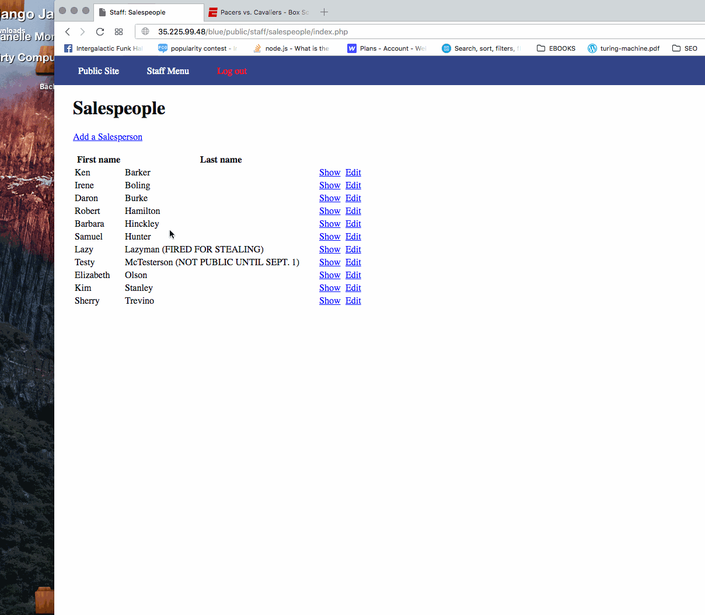
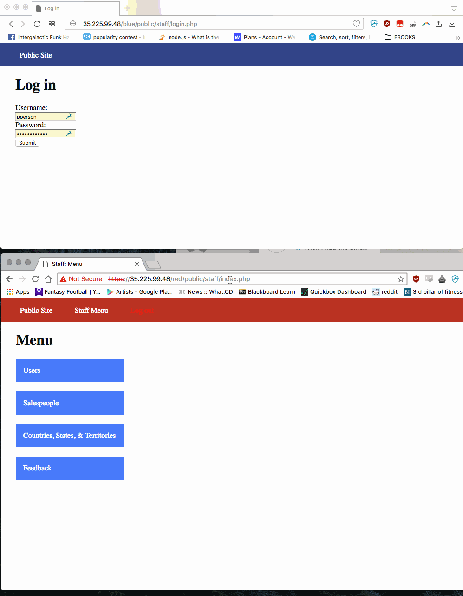
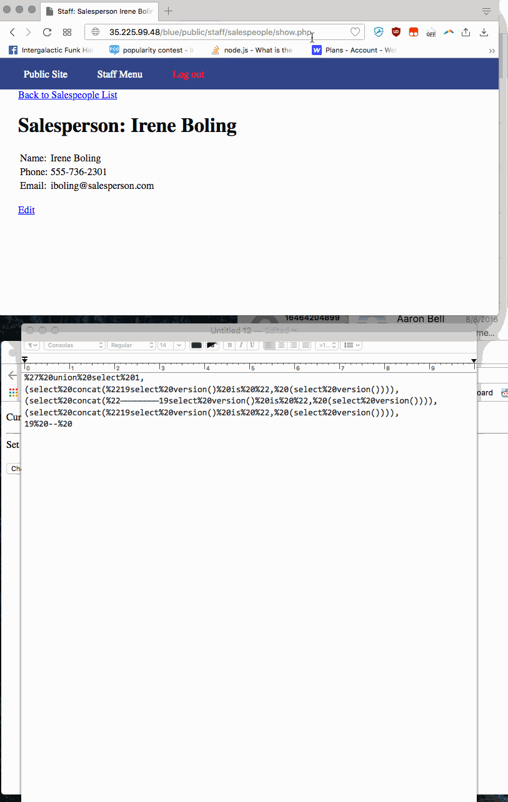
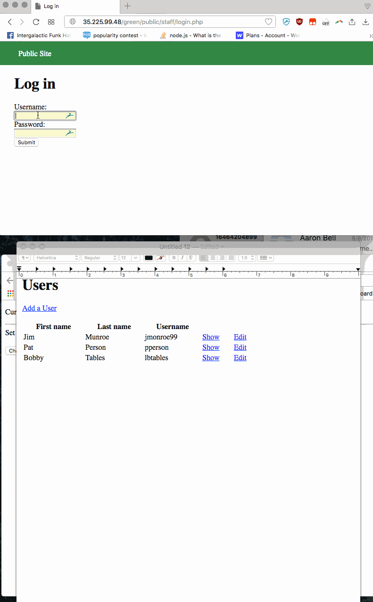
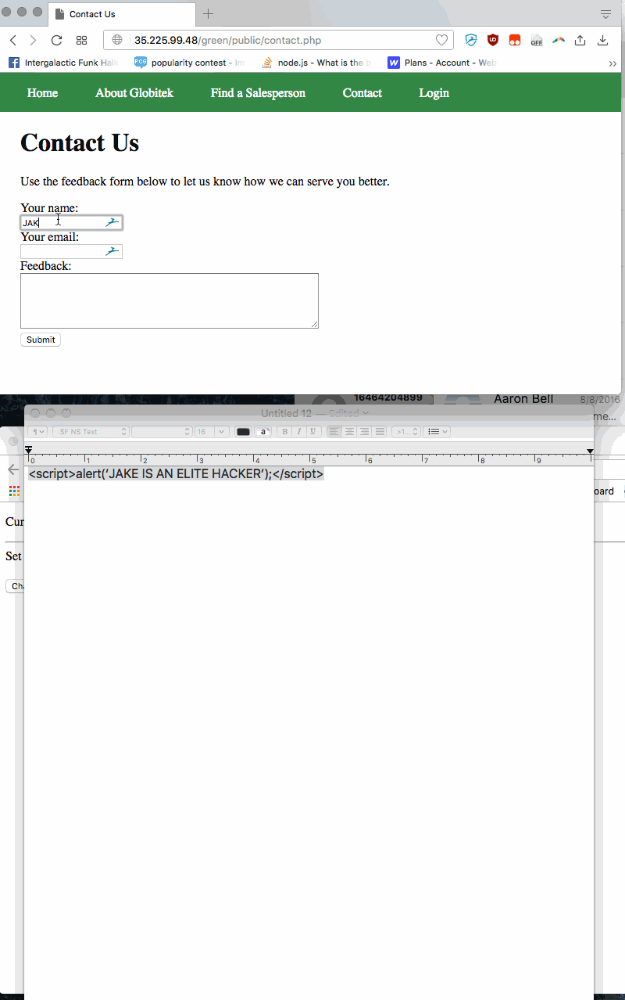
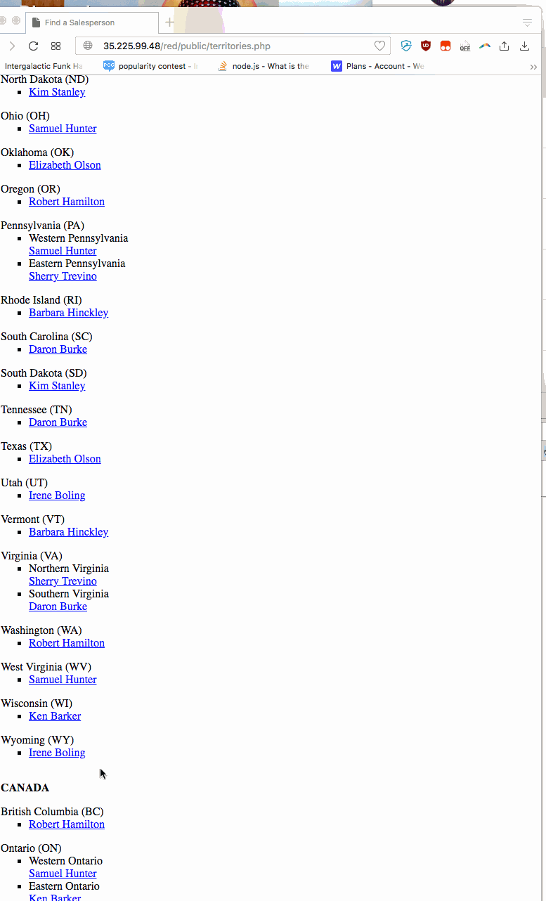
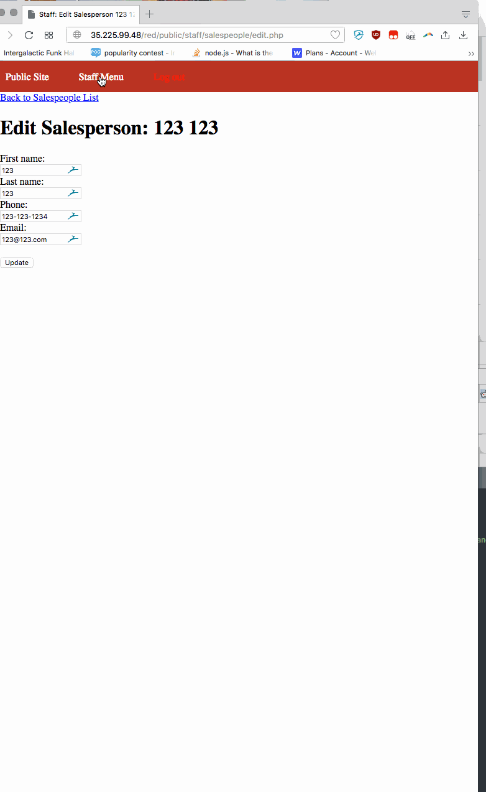

# Project 8 - Pentesting Live Targets

Time spent: 6 hours spent in total

> Objective: Identify vulnerabilities in three different versions of the Globitek website: blue, green, and red.

The six possible exploits are:
* Username Enumeration
* Insecure Direct Object Reference (IDOR)
* SQL Injection (SQLi)
* Cross-Site Scripting (XSS)
* Cross-Site Request Forgery (CSRF)
* Session Hijacking/Fixation

Each version of the site has been given two of the six vulnerabilities. (In other words, all six of the exploits should be assignable to one of the sites.)

## Blue

<b>SQL INJECTION #1</b>

WE USE A BASIC COMMAND TO SET A TIMER THAT RELOADS THE SALE PERSON PAGE AFTER THE SET AMOUNT OF TIME

<b>SESSION HIJACKING</b>

WE LOGIN INTO THE GREEN SITE (OR RED) AND GO TO THE HACKTOOLS DIRECTORY— THERE WE FIND AN UNPROTECTED PHP PAGE THAT ALLOWS USE TO GRAB THE SESSION ID. WE COULD ALSO ACCOMPLISH THIS USING BURP.

WE THEN GO BACK TO OUR BLUE SITE (DO NOT LOGIN)— WE NAVIGATE TO THE SAME HACKTOOLS DIRECTORY AND USING THE SESSION ID FROM THE OTHER SESSION WE CHANGE IT. WE NOW ARE ABLE TO LOGIN TO THE WITHOUT USING ANY CREDENTIALS

<b>SQL INJECTION #2 (BONUS)</b>

WE USE A CRAFTED COMMAND THAT PULLS THE VERSION OF THE DATABASE INTO EACH FIELD OF A SALESPERSON

USED THE FOLLOWING AS REFERENCE: http://voice0fblackhat.blogspot.com/2012/01/super-detailed-sql-injection-tutorial.html

## Green

<b>USER ENUMERATION</b> 

VERY SIMPLE— WE FIRST LOGIN AND SEE ALL THE USERS THAT ARE ALLOWED TO LOGIN. WE GO BACK TO THE LOGIN PAGE AND TRY ONE AND SEE WHAT HAPPENS WITH A WRONG PASSWORD. WE THEN TRY THIS AGAIN BUT WITH A USER THAT DOESN’T EXIST. WE NOTICE VERY QUICKLY THAT THE ERROR MESSAGE IS NOT BOLD. THIS REVEALS TO THE HACKER WHAT USER NAMES ARE ACCEPTABLE (VIA BRUTEFORCE).

<b>XSS</b>

WE GO TO THE PUBLIC SITE AND NOTICE THAT WE HAVE A FEEDBACK FORM. THESE ARE VERY OFTEN SUSCEPTIBLE TO CROSS-SITE SCRIPTING. WE TRY INSERTING A BASIC ALERT SCRIPT. WE NOW GO LOGIN TO THE STAFF SIDE TO SEE OUR FEEDBACK. SURE ENOUGH, WHEN THE PAGE IS LOADED IT DISPLAYS AN ALERT BOX.

## Red

<b>Insecure Direct Object Reference</b>

THIS IS VERY OBVIOUS BY LOOKING AT ALL THE SALESPEOPLE FROM THE ADMIN PAGE. WE SEE THAT THERE IS ONE THAT IS NOT PUBLICLY LISTED ON THE SITE. WE GO TO THE ADDRESS BAR AND GRAB THE USER ID. NOW WE GO BACK TO THE PUBLIC SITE TO ANOTHER USER PAGE. WE THEN SWAP THE USER ID. SURE ENOUGH, IT LOADS THE UNLISTED SALESPERSON.

<b>CSRF</b>

THE SITE DOES NOT USE ANY SORT OF TOKENS TO IDENTIFY AN ADMIN USER. THIS ALLOWS USER TO EDIT PARTS OF THE SITE BY CREATING OUR OWN HTML PAGES AND LOADING THEM IN THE BROWSER

## Notes
